<div align="center">
  
</div>

<div align="center">
  
</div>

<p align="center">
  
  <a href="https://github.com/Impulse69?tab=followers"></a>
  
</p>


## ⛩️ // whoami

```javascript
const isaac = {
  name: "Isaac Asamoah",
  alias: ["Impulse69", "Ghost_off_Uchiha"],
  base: "Ghana 🇬🇭",
  role: "Software Developer — systems from scratch",
  ships: ["web platforms", "desktop software", "android apps", "trading bots"],
  languages: ["TypeScript", "JavaScript", "Python", "Java", "PHP", "SQL", "MQL5"],
  core: ["React", "Next.js", "Node.js", "Express", "FastAPI", "Electron"],
  data: ["PostgreSQL", "SQLite", "Supabase", "Prisma", "Sanity"],
  questLog: [
    "Shipping production software for real businesses",
    "Building an AI-native creative OS for children's animation",
    "Open to collabs — bring your wildest ideas",
  ],
  poweredBy: ["late-night commits", "anime arcs", "dark mode everything"],
};
```


## 🗡️ // arsenal

<div align="center">


<br />


<br />


<br />


<br />


<br />


<br />


<br />


<br />


<br />


<br />


<br />


<br />


<br />


<br />


<br />


<br />


<br />


<br />


<br />


<br />


</div>


## 📊 // battle stats

<div align="center">
  
  
</div>

<div align="center">
  
</div>

<div align="center">
  
</div>

<div align="center">
  
</div>


## 🐍 // the snake feeds at midnight

<div align="center">
  
</div>


## 🏯 // featured builds

<div align="center">
  <a href="https://github.com/Impulse69/aurora-studioos">
    
  </a>
  <a href="https://github.com/Impulse69/donkor-rentals">
    
  </a>
  <a href="https://github.com/Impulse69/mql5-trading-bots">
    
  </a>
  <a href="https://github.com/Impulse69/Custom-Portfolio-Builder">
    
  </a>
  <a href="https://github.com/Impulse69/ExpenseTracker">
    
  </a>
  <a href="https://github.com/Impulse69/Portfolio-V3">
    
  </a>
</div>


## ⚡ // recent moves

<!--START_SECTION:activity-->
<!--END_SECTION:activity-->

<sub>⟳ this section refreshes itself automatically via GitHub Actions</sub>


## 📡 // summon me

<p align="center">
  <a href="https://t.me/Ghost_off_Uchiha"></a>
  <a href="https://www.instagram.com/junior_ike_/"></a>
  <a href="https://wa.me/+233245697141"></a>
</p>

<div align="center">
  
</div>
